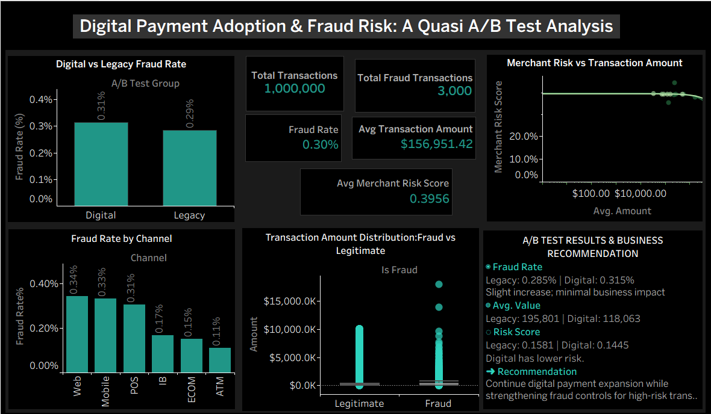

# Optimizing Digital Payment Performance Using Quasi A/B Testing

## Executive Summary

### Business Problem

A FinTech company wants to evaluate whether modern digital payment channels perform better than traditional payment channels in terms of fraud rate, transaction value, and transaction risk.

Since the dataset was not generated from a randomized experiment, a **quasi-experimental A/B testing framework** was applied to compare naturally occurring payment channel groups and understand the impact of digital payment adoption.

The analysis focused on answering:

**"Do digital payment channels provide better transaction performance while maintaining acceptable fraud and risk levels compared to traditional payment methods?"**

---

## Solution

An end-to-end analytics approach was developed using Python and Tableau to:

- Compare digital and traditional payment channel performance
- Analyze transaction behavior and spending patterns
- Evaluate fraud exposure across payment groups
- Measure risk using merchant risk score and composite risk indicators
- Generate actionable recommendations for digital payment growth and fraud prevention

---

## Business Impact

The analysis provided insights into how digital payment adoption affects business performance and risk management.

Key metrics analyzed:

- **Total Transactions Analyzed:** 1,000,000
- **Total Features Available:** 38 transaction-level attributes
- Fraud rate comparison between payment groups
- Transaction value differences
- Merchant risk exposure
- Overall transaction risk indicators

The findings support a balanced strategy:

- Continue expanding digital payment adoption
- Maintain proactive fraud monitoring
- Use risk-based controls instead of limiting digital growth

---

# Business Problem

Digital payment channels provide faster transactions and improved customer convenience, but increased digital adoption can introduce new fraud and operational risks.

The company needed to understand:

- Whether digital channels perform differently from traditional channels
- Whether transaction values vary between payment groups
- Whether digital transactions create additional fraud exposure
- Which risk indicators should be prioritized for monitoring

---

# Methodology

## 1. Data Understanding & Preparation

Dataset overview:

- Rows: **1,000,000**
- Columns: **38**

Performed:

- Dataset structure validation
- Data quality checks
- Feature understanding
- Preparation for comparative analysis

---

## 2. Quasi A/B Test Design

Since customers were not randomly assigned to payment channels, a quasi A/B testing approach was used.

### Groups Compared:

| Group | Description |
|---|---|
| Treatment Group | Digital Payment Channels |
| Control Group | Traditional Payment Channels |

The groups were compared across:

- Fraud rate
- Transaction value
- Merchant risk
- Composite risk score

---

## 3. Exploratory Data Analysis

Analyzed:

- Customer transaction behavior
- Payment channel distribution
- Transaction amount patterns
- Merchant category risk
- Risk score distribution

---

## 4. Risk Analysis

Evaluated risk indicators including:

- Merchant Risk Score
- Composite Risk Score
- Transaction behavior patterns

This helped identify areas where additional fraud controls may be required.

---

# Skills & Tools

## Programming & Analytics

- Python
- Pandas
- NumPy
- Matplotlib
- Seaborn

## Statistical Analysis

- Quasi A/B Testing
- Hypothesis Testing
- Comparative Analysis

## Data Visualization

- Tableau
- Interactive Dashboard Development
- KPI Analysis

## Business Analytics

- Fraud Risk Analysis
- Customer Transaction Analysis
- Data-Driven Recommendations

---

# Results & Insights

## 1. Digital Payment Adoption

The analysis compared digital and traditional payment channels based on:

- Fraud behavior
- Transaction value
- Merchant risk exposure
- Overall transaction risk

### Finding:

Digital payment channels demonstrated strong growth potential and improved customer accessibility.

The results support continued investment in digital payment adoption while maintaining appropriate risk controls.

---

## 2. Fraud Risk Management

Digital channels provide scalability benefits but require continuous monitoring to manage fraud exposure.

### Key Insight:

Fraud prevention strategies should focus on transaction risk signals rather than restricting digital payment adoption.

Important risk indicators:

- Merchant risk score
- Composite risk score
- Suspicious transaction behavior

---

## 3. Transaction Behavior Optimization

Analysis of transaction values showed differences in customer spending behavior across payment groups.

### Business Opportunity:

The company can:

- Encourage higher-value digital transactions
- Improve digital payment experiences
- Use customer segmentation for personalized payment strategies

---

## 4. Risk-Based Decision Making

Risk analysis highlighted the importance of proactive fraud prevention.

High-risk areas can be prioritized using:

- Merchant risk scores
- Transaction behavior patterns
- Composite risk indicators

---

# Business Recommendations

## 1. Continue Digital Payment Expansion

The company should continue promoting digital payment adoption because digital channels provide scalability and improved customer accessibility.

However, growth should be supported with strong risk management practices.

---

## 2. Implement Adaptive Fraud Detection Rules

Instead of applying identical fraud controls to all transactions:

- Create dynamic fraud rules based on transaction behavior
- Increase verification for high-risk digital transactions
- Monitor unusual payment patterns in real time

---

## 3. Prioritize High-Risk Merchants

Merchant risk scores should be integrated into fraud monitoring systems.

Recommended actions:

- Review merchants with consistently high risk scores
- Adjust transaction approval thresholds
- Increase monitoring for risky merchant categories

---

## 4. Use Risk Scores for Better Decisions

Combine:

- Transaction value
- Merchant risk
- Composite risk score
- Customer behavior

to create stronger fraud detection models and improve decision accuracy.

---

## 5. Continuously Monitor Digital Payment Performance

Regular analysis should be performed to track:

- Fraud trend changes
- Customer adoption patterns
- Transaction value growth
- Effectiveness of fraud controls

---

# Dashboard Preview

---

# Project Structure

├── data/
├── notebooks/
│ └── fintech_ab_testing_analysis.ipynb
├── dashboard/
│ ├── fraud_analysis_dashboard.png
│ └── fraud_analysis_dashboard.twb
└── README.md

---

# Author

**Sandleen Sethi**  
Data Analyst Portfolio Project
